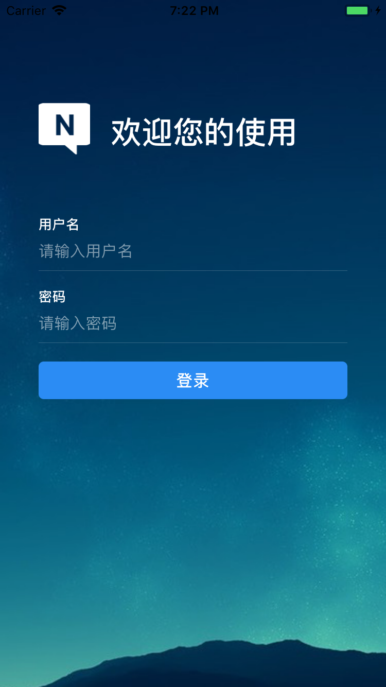
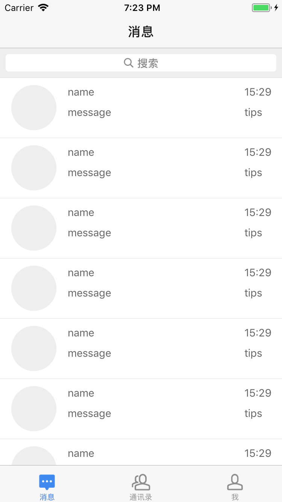
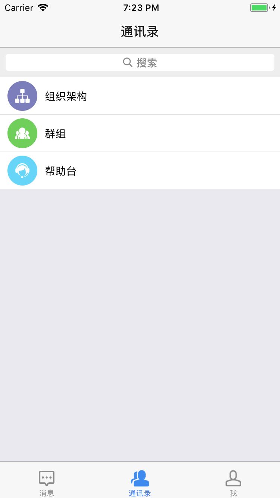
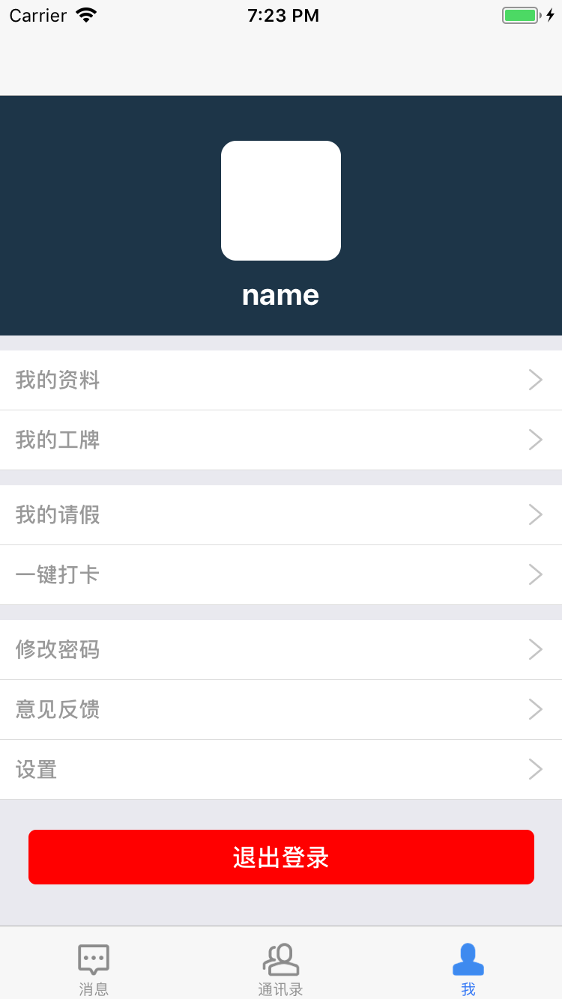

## 概述
内部聊天应用（只支持iOS端）

## 技术方案
路由： react-navigation  
数据管理及存储： react-native-storage

## 目录结构
```
|
|---- android 安卓相关
|
|---- bundle 存放打包后生成的文件
|
|---- design 设计相关
|
|---- ios iOS相关
|
|---- node_modules 依赖库
|
|---- src ---|---- asset 静态图片
|            |
|            |---- components 公用组件
|            |
|            |---- config 路由配置
|            |
|            |---- pages 业务组件
|
...
```
## 使用
```
$ git clone https://github.com/wengwengweng/awesome-chat-ios.git
$ cd awesome-chat-ios
$ npm install
$ npm run dev
```
## UI
颜色：
- #3E8AEF 深蓝
- #569FF1
- #F7F7F7
- #8a8a8a 深灰
- #DBDCE0

## 截图

| 登录 | 消息列表 | 联系人列表 | 个人中心 |
| ---- | ---- | ---- | ---- |
|  |  |  |  |

## 本地存储的数据结构
```
{
   // 当前用户信息
  userInfo: {},
  // 上次拉取消息时间
  lastUpdateTime: '',
  // 聊天室信息（会话）
  rooms: [
    {
      roomId: '',
      // 群名字
      roomName: '',
      // 对方名称
      otherSideName: '',
      // 新消息数量
      newMessageNum: '',
      // 信息
      messages: [
        {
          // 是否是当前用户发出的信息
          isMine: true,
          createTime: '',
          content: '',
        }
      ]
    },
    ...
  ]
}
```